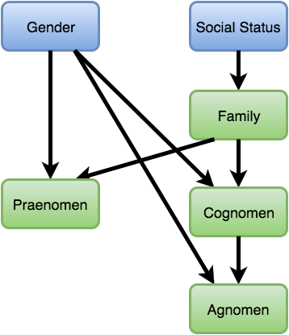

# Rolling Random Romans

This is a simple project to experiment with randomness in [Elm]. It generates
random Roman names according to the [_tria nomina_] scheme of the late Republic.
Some of the random components are independent and some are dependent.

[Elm]: http://elm-lang.org/
[_tria nomina_]: https://en.wikipedia.org/wiki/Roman_naming_conventions#The_tria_nomina

## Variables

There are a several independent and dependent variables involved in rolling a
random Roman.

* Gender - Independent variable
* Social Status - Patrician/Plebian, independent variable.
* Family - Historical family (or gens), depends on social status.
* Praenomen - Personal name. Weighted towards historical family preference.
  Women don't have one.
* Cognomen - Nickname, can be hereditary and denote a particular branch of a
  family. Depends on family. Random generic cognomen rolled if family has no
  associated cognomina. Women don't have one.
* Agnomen - A second nickname or honorific. Only present if a cognomen is
  present. Women don't have one.

